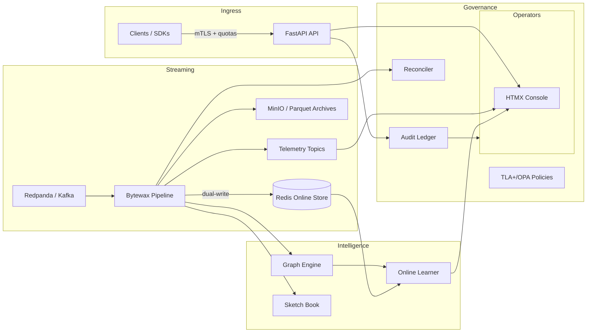

# AegisFlux

**Air-gapped realtime fraud defense for mission-critical payment flows.**

[](LICENSE) [](.github/workflows/ci.yml)  

> AegisFlux is a hermetic, CPU-only, realtime fraud platform delivering sub-second inference, adaptive governance, and verifiable supply-chain integrity in a 350-character footprint suitable for marketplaces, fintechs, and payment processors that demand deterministic protection even when air-gapped.

## ✨ Highlights

- **Realtime scoring** with FastAPI, Bytewax, Redis, and incremental graph features for entity-level intelligence.
- **Online learning** via pure-Python monotonic logistic regression, conformal calibration, and contextual bandits.
- **Exactly-once streaming** pipelines with dual-write cutovers, deterministic WAL recovery, and schema-governed contracts.
- **Security posture** including mTLS with SPKI pinning, WAF-lite anomaly screening, quotas, and timing-leak guards.
- **Privacy & compliance** through DSAR receipts, legal holds, IDNA/Unicode hardening, and differential privacy telemetry.
- **Governance & audit** with Merkle ledgers, reconciler proofs, disaster-restore rehearsals, and mutation-safe OpenAPI diffing.
- **Air-gapped reproducibility** powered by Nix flakes, vendored wheelhouse, reproducible container manifests, and SDK SemVer gates.
- **Operator experience** featuring a cinematic console, drain/freeze modes, burn-rate ladders, and diagnostic bundles.

## 🏗️ Architecture Overview



## ⚡ Quickstart

> Requires Docker (optional), Python 3.11, and Node 20. All commands run offline.

```bash
make dev                 # install editable deps (offline wheelhouse supported)
make up                  # start full stack via docker compose
make seed                # stream synthetic transactions
make shots               # generate screenshots (Docker or local uvicorn fallback)
make test                # run pytest suite
make docs-verify         # validate docs, screenshots, maintainer contacts
```

### Minimal local run without Docker

```bash
python -m pip install -r requirements.lock
uvicorn app.main:app --host 127.0.0.1 --port 8000 &
python scripts/capture_screens.py --base http://127.0.0.1:8000 --out docs/assets
pytest -q
```

## 📡 API Usage

### cURL

```bash
curl -H 'X-API-Key: $API_KEY' -H 'Content-Type: application/json' \
  -H 'Idempotency-Key: sample-key' \
  -d '{"event_id":"evt-1","tenant_id":"tenant","amount_minor":1299,"currency":"USD","user_id":"u123"}' \
  http://127.0.0.1:8000/v1/predict
```

### Python SDK

```python
from aegisflux import Client

client = Client(base_url="http://127.0.0.1:8000", api_key="local-key", spki_pins=["sha256/..."])
result = client.predict(event_id="evt-1", tenant_id="tenant", amount_minor=1299, currency="USD")
print(result.decision, result.probability, result.rate_limit.remaining)
```

### TypeScript SDK

```ts
import { createClient } from "@aegisflux/sdk";

const client = createClient({
  baseUrl: "http://127.0.0.1:8000",
  apiKey: "local-key",
  spkiPins: ["sha256/..."]
});

const res = await client.predict({
  event_id: "evt-1",
  tenant_id: "tenant",
  amount_minor: 1299,
  currency: "USD"
});

console.log(res.decision, res.headers["x-ratelimit-remaining"]);
```

## 🖥️ Screenshots

Screenshots are stored with Git LFS for reliable diffs. Run `make lfs-init` (or `git lfs pull`) before viewing them locally.

| Light Console | Dark Console |
| --- | --- |
|  |  |

| OpenAPI Reference | Predict Playground |
| --- | --- |
|  |  |


## 🔁 Operations & Safety

- **Migrations**: dual-write with `make dual-write-*` targets guarded by leader election and parity metrics.
- **Freeze & Drain**: `MAINTENANCE_FREEZE=1` blocks mutations; `make drain-start` coordinates graceful restarts.
- **Receipts**: `/v1/decide` issues signed decision receipts for high-value flows.
- **Disaster Recovery**: `make restore-drill` replays WAL and snapshots into a sandbox and exports invariants.
- **Integrity**: `make integrity`, `make verify-sigs`, and `make repro-build` pin hashes across builds.

## 🔐 Security Posture

See [SECURITY.md](SECURITY.md) for disclosure process, SBOM policy, dependency cadence, and coordinated response expectations.

## 🤝 Contributing

Read [CONTRIBUTING.md](CONTRIBUTING.md) for development workflow, gating checks, and DCO requirements.

## 🌐 Code of Conduct

Participation is governed by the [Code of Conduct](CODE_OF_CONDUCT.md).

## 📄 License

Released under the [Apache License 2.0](LICENSE).

## 👤 Maintainer

Alan Uriel Saavedra Pulido <alanursapu@gmail.com>
