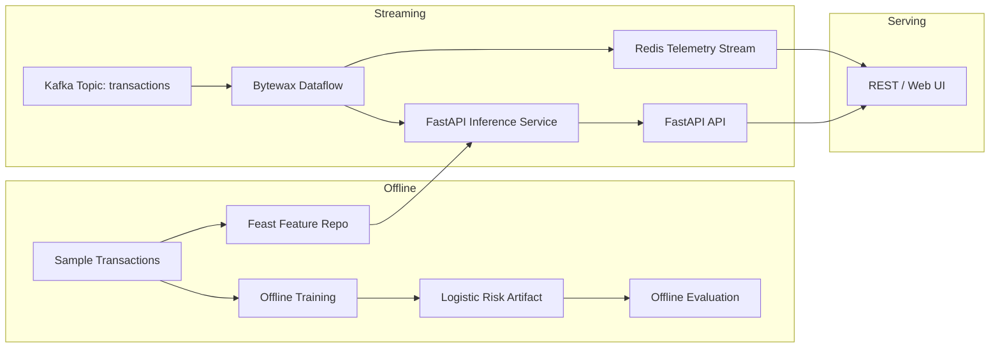

# Hyperion Fraud Defense

**World-class, sub-200ms streaming fraud detection platform** powered by FastAPI, Kafka, Bytewax, Feast, Redis, and a pure-Python incremental risk engine. Hyperion brings together online learning, offline evaluation, and a cinematic command center UI to protect transactions at planetary scale.

## 🚀 Highlights

- **Sub-second decisions** – Optimized inference pipeline with latency tracking and adaptive thresholds.
- **Event-driven streaming** – Bytewax dataflow consumes Kafka events, enriches with Feast features, and writes realtime telemetry to Redis.
- **ModelOps ready** – Offline training & evaluation scripts, deterministic model artifacts, and reproducible pipelines backed by online updates.
- **Hybrid feature store** – Feast online store backed by Redis for millisecond feature retrieval.
- **Futuristic operator console** – FastAPI serves an immersive dashboard for the risk team.
- **Cloud native** – Docker Compose stack for API, Bytewax workers, Feast, Kafka, and Redis.
- **Closed-loop governance** – Delayed chargeback feedback, conformal calibration, and policy-driven decisions continuously tune the online learner.
- **Privacy-first operations** – Deterministic hashing, retention enforcement, differential privacy noise, and doctor checks ensure deploy-time compliance.
- **Probabilistic telemetry** – Count–Min Sketches, HyperLogLog uniques, and stable Bloom replay guards feed the model alongside personalised PageRank and ego-centric centrality signals.
- **Air-gapped ready** – Vendored wheelhouse, saved container images, and a Nix flake provide hermetic builds and reproducible tooling offline.
- **Formally specified resilience** – Lightweight TLA+ specs and automated simulations guard exactly-once pipelines and canary rollouts.
- **Policy as code** – Rego policies with unit coverage harden request admission and override playbooks.

## 🧱 Architecture Overview



## 📦 Project Layout

```
├── app/                 # FastAPI service, inference engines, UI
├── streaming/           # Bytewax pipeline & adaptive state
├── offline/             # Training & evaluation scripts
├── feature_repo/        # Feast feature definitions
├── scripts/             # Utilities (Kafka event seeder)
├── dockerfiles/         # Container definitions for API & Bytewax
├── data/                # Sample dataset & Feast registry
├── artifacts/           # Deterministic logistic weights & reports
├── tests/               # Pytest-based smoke tests
├── docker-compose.yml   # Full stack orchestration
└── pyproject.toml       # Dependencies & tooling
```

## 🔧 Quickstart

1. **Clone and configure**
   ```bash
   git clone https://github.com/your-org/hyperion-fraud-defense.git
   cd hyperion-fraud-defense
   cp .env.example .env  # optional overrides
   ```

2. **Bootstrap Feast registry**
   ```bash
   feast -c feature_repo apply
   feast -c feature_repo materialize-incremental `date +%Y-%m-%d`
   ```

3. **Launch the platform**
   ```bash
   docker compose up --build
   ```
   - FastAPI API & console: <http://localhost:8000>
   - Feast online store: <http://localhost:6566>
   - Kafka broker: `localhost:9092`

4. **Generate synthetic traffic**
   ```bash
   make seed
   ```
   Watch decisions stream into the UI instantly.

5. **Offline modeling**
   ```bash
   python offline/train_model.py
   python offline/evaluate.py
   ```

6. **Operational drills**
   ```bash
   make chaos      # inject latency & packet-loss simulations
   make k6         # enforce latency SLOs on the warm path
   make replay     # validate determinism of archived batches
   ```

## ✅ Operational Gates

- `make golden` – Verifies deterministic `/predict` and streaming snapshots against the approved hashes in `artifacts/golden/`.
- `make hygiene` – Traverses the import graph to catch orphan modules, cycles, and hot-path heavyweight imports.
- `make config-lint` – Normalises `.env.example`, flags missing or unknown configuration knobs, and writes `artifacts/config_lint.json`.
- `make caps-check` – Dumps live resource-cap telemetry (Redis stream, graph nodes/edges, sketches) and fails on hard-cap breaches.
- `python scripts/openapi_diff.py` – Generates an OpenAPI diff against `artifacts/openapi/baseline.json`, classifies SemVer impact, and refreshes `docs/offline_changelog.md`.

## 🧠 Online Learning Hooks

- `streaming/state.py` keeps a rolling concept-drift detector – wire its signal to trigger retraining or threshold updates.
- Redis Stream (`hyperion:predictions`) exposes realtime decisions for downstream consumers and dashboards.
- Feast integrates both offline features (for training) and online features (for inference) with a single definition of truth.

## 🛡️ API Reference

| Endpoint | Description |
| --- | --- |
| `POST /api/v1/infer` | Score a transaction and return probability, classification, and live metrics. |
| `GET /api/v1/metrics` | Snapshot of latency percentiles and throughput. |
| `GET /health` | Liveness probe. |

Request payload example:

```json
{
  "transaction_id": "txn_12345",
  "customer_id": "cust_001",
  "merchant_id": "mch_777",
  "amount": 129.99,
  "currency": "USD",
  "device_trust_score": 0.82,
  "merchant_risk_score": 0.42,
  "velocity_1m": 1.1,
  "velocity_1h": 0.2,
  "chargeback_rate": 0.03,
  "account_age_days": 640,
  "customer_tenure": 4.1,
  "geo_distance": 120.0
}
```

## 📊 Observability & Governance

- **Latency & throughput** – Captured in-process via `LatencyTracker` & `ThroughputTracker`, exported with exemplar trace IDs.
- **Shadow & canary telemetry** – `app/services/shadow.py` persists mirrored traffic while `app/services/canary.py` automates rollback when guardrails fail.
- **Calibration insights** – `OnlineLogisticRegression` publishes Brier score & ECE metrics for dashboards.
- **Drift metrics** – Bytewax helpers compute PSI / KS deltas feeding Grafana panels.
- **Offline evaluation** – Generates ROC/PR curves and histograms in `artifacts/evaluation`.

## ♻️ Exactly-once semantics

- `streaming.pipeline.RedisDeduplicator` composes deterministic hashes and defends sinks with TTL-governed inserts.
- Downstream consumers receive an explicit `dedupe_hit` flag and event fingerprint for audit trails.
- Replay determinism hashes guarantee time-travelled scoring matches original results when `model_hash` is unchanged.

## 🔐 Supply-chain & release hardening

- `make sbom` materialises an SBOM (`artifacts/sbom.json`) from the pinned dependency set.
- `make scan` verifies every dependency is version-pinned; `make sign` emits a SHA-256 signature for release artifacts.
- `make release` guards publication by ensuring SBOM and signatures are present.

## 🧪 Testing & Quality

```bash
pytest
make k6
make chaos
make mutate
make sketch-bench
make ppr-bench
make forecast
make hdr-compare
make flags-check
```

## 📄 License

Distributed under the [MIT License](LICENSE).

## 🌐 Repository Metadata

- **Repository name**: `hyperion-fraud-defense`
- **Short description**: Ultra-low latency streaming fraud defense with FastAPI, Bytewax, Feast, Redis, Kafka, and a pure-Python online learner, complete with offline evaluation and a cinematic operator console.

